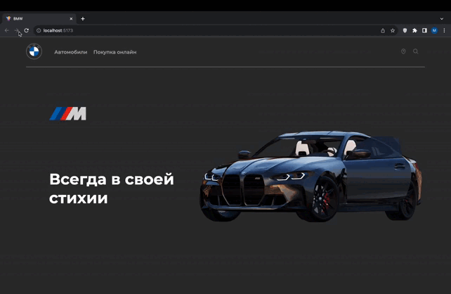

<h1>Диллерский центр</h1>
 

<h2>Функционал сайта</h2>
 
<li>Конфигуратор машин</li>
<li>Категории машин</li>
<li>Машины на продаже</li>
<li>Поиск по названиям машин</li>
<li>Покупка выбранной машины</li>
<li>Запись на сервис</li>
 

<h2>Технологии проекта</h2>
 
<li>React</li>
<li>Redux</li>
<li>Redux-ToolKit</li>
<li>Redux Thunk</li>
<li>React Router</li>
<li>Prettier</li>
<li>Git</li>
<li>Node js</li>
<li>NodeJS</li>
<li>JavaScript</li>
 

<h2>Команда проекта</h2>
 
<a align="center" textDecoration='none' color='#fff' href="https://github.com/mus1im03"> BARIEV MUSLIM</a>
<a align='center' textDecoration='none' color='#fff' href="https://github.com/ltovsultanovl"> TOVSULTANOV SHAMHAN</a>
<a align="center" textDecoration='none' color='#fff' href="https://github.com/YacubB"> BAHANOEV YAKUB</a>
<a align="center" textDecoration='none' color='#fff' href="https://github.com/Halifat77"> SHIMAEV ABDUL-MALIK</a>
<a align="center" textDecoration='none' color='#fff' href="https://github.com/Rahman095"> HADZHIEV RAHMAN</a>
